# DnCNN-with-TensorBoardX

The PyTorch implementation of TIP 2017 paper DnCNN, the pioneer DL-based work related to image denoising.

We also provide real-time validation and visulization.

A TensorBoardX usage sample is given as:
```
tensorboard --logdir=runs --host=10.1.75.35 --port=9512
```

## 1 Noise Estimate

At first, the estimation PSNR of given noise range is shown as follows:

zero mean Gaussian noise

| standard deviation in [0, 1] | 0.1 | 0.075 | 0.05 | 0.04 | 0.03 | 0.02 | 0.01 | 0.0075 | 0.005 | 0.001 |
| :----- | :-----: | :-----: | :-----: | :-----: | :-----: | :-----: | :-----: | :-----: | :-----: | :-----: |
| standard deviation in [0, 255] | 25.5 | 19.125 | 12.75 | 10.2 | 7.65 | 5.1 | 2.55 | 1.9125 | 1.275 | 0.0255 |
| average PSNR | 20.00 | 22.46 | 26.00 | 27.95 | 30.47 | 33.98 | 40.00 | 42.49 | 46.00 | 60.00 |
| average L2 | 0.01 | 0.0056 | 0.0025 | 0.0016 | 0.0009 | 0.0004 | 0.0001 | 0.000056 | 0.000025 | 0.000001 |
| average L1 | 0.08 | 0.06 | 0.04 | 0.0318 | 0.024 | 0.016 | 0.008 | 0.006 | 0.004 | 0.0008 |

## 2 Noise Examples

There are some examples, corresponding to specific noise standard deviation.

### Standard Deviation = 0.3

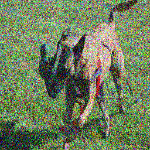

### Standard Deviation = 0.2

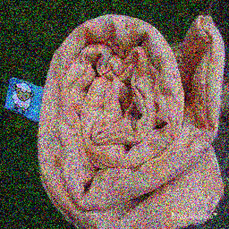

### Standard Deviation = 0.18

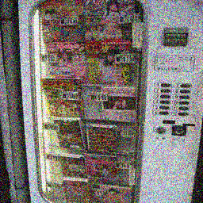

### Standard Deviation = 0.15

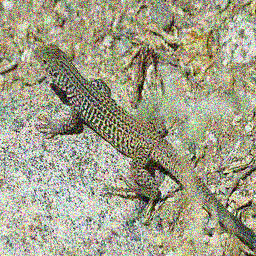

### Standard Deviation = 0.12

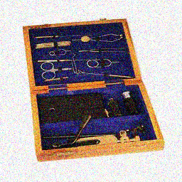

### Standard Deviation = 0.1

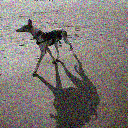

### Standard Deviation = 0.075

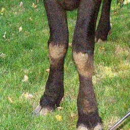

### Standard Deviation = 0.05


### Standard Deviation = 0.04

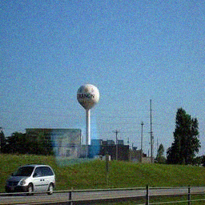

### Standard Deviation = 0.03

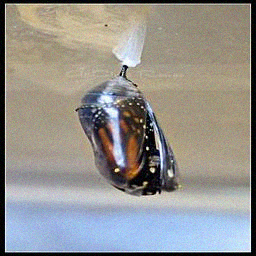

### Standard Deviation = 0.02

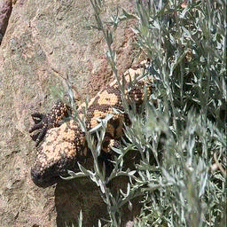

### Standard Deviation = 0.01

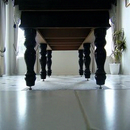

### Standard Deviation = 0.0075


### Standard Deviation = 0.005

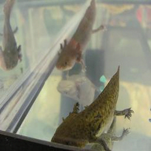

### Standard Deviation = 0.001


## 3 Experimental Results

Given a noisy image from COCO database, the DnCNN can enhance it, but the results are not good.

The most important part is the residual learning, while replacing last layer as a sigmoid activated one is also good.
